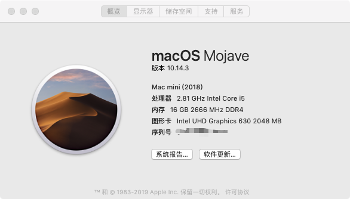
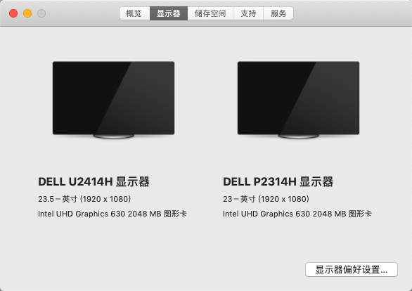

# hackintosh-efi
觉得还不错，望能加个  :star:star  :smile:

### 一、我的主机配置

- 主板： 技嘉 gigabyte-b360m-d3h
- CPU：intel i5 8400
- 显卡：目前使用核显
- 内存条：金士顿 8G DDRL4*2
- 显示器：2台 分别使用 DP 和 HDMI接口
- 固态硬盘：三星 970 EVO 250G NVMe M.2 SSD

### 二、实现的效果

>目前版本 **10.14.3** 使用正常。双显示器使用正常。

### 三、BOIS 修改

1. 硬盘模式调整为 AHCI
2. 开启支持 UEFI 启动，一般默认是开启的
3. 关闭VT-d，安完完系统后，再开启
4. 关闭CFG-Lock（我的BIOS没有此选项）
5. 关闭Secure Boot Mode
6. OS Type选项，设置为 Other OS
7. 关闭IO SerialPort
8. 设置 XHCI Handoff 为 开启

### 四、我的黑苹果主要遇到的问题

#### 4.1 clover基础知识

<https://blog.daliansky.net/clover-user-manual.html>

#### 4.2 如何安装？

1、修改 bois 

2、可以看这一篇教程

<https://blog.daliansky.net/macOS-Mojave-10.14.4-18E226-official-version-with-Clover-4903-original-image.html>

#### 4.3 显卡驱动不了，或者只显示7m？

> **主要使用 hackintool 2.1.0 解决显卡问题**
>
> 详细可以参考这篇文章

<https://blog.daliansky.net/Intel-FB-Patcher-tutorial-and-insertion-pose.html>

**注意：10.13.6 使用 hackintool 解决不了核显问题，升级10.14.*解决** 

